# Déployer une architecture Web 2-Tier ultra-sécurisée sur Azure (Apache & MariaDB)

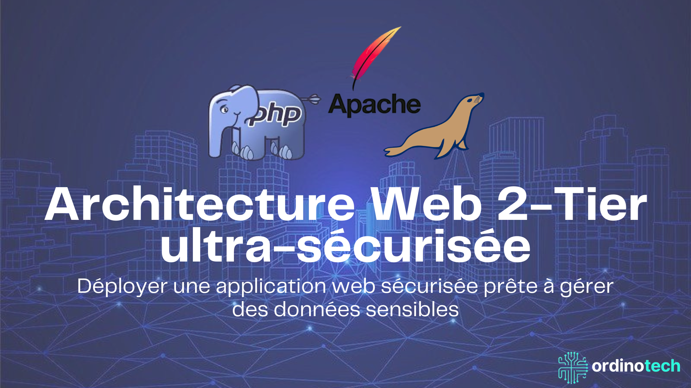

N'importe qui peut mettre un site en ligne en une heure. Le faire correctement, avec une base de données qui ne traîne pas à portée de n'importe quel bot qui scanne Internet, c'est une autre histoire. Ce projet documente le déploiement d'une architecture 2-tier sur Azure : un serveur web accessible depuis l'extérieur, un serveur de base de données qui, lui, ne parle qu'à une seule machine sur toute la planète.

## Ce que le projet couvre

Séparer les rôles Web et base de données n'est pas qu'une question d'organisation, c'est une question de surface d'attaque. En cachant le serveur de données derrière un réseau virtuel privé, on retire purement et simplement une cible d'Internet. Le projet passe par la conception et le déploiement de l'infrastructure sur Azure, la mise en place d'une défense à deux niveaux (pare-feu cloud côté Azure, pare-feu système côté Linux), et la sécurisation des échanges avec un certificat SSL.

## Stack technique

| Composant | Technologie |
|---|---|
| Cloud | Microsoft Azure |
| OS | Ubuntu Server |
| Serveur Web | Apache2 + PHP 8.3 |
| Base de données | MariaDB |
| Certificat SSL | Certbot (Let's Encrypt) |
| Pare-feu cloud | Azure NSG |
| Pare-feu système | UFW |

## Architecture

```
                Internet
                    |
              HTTPS (443)
                    |
        +-----------------------+
        |   WebServer (public)  |
        |   Apache + PHP        |
        |   IP privée: 10.0.0.4 |
        +-----------------------+
                    |
        VNet privé 10.0.0.0/16
        (invisible depuis Internet)
                    |
        +--------------------------+
        |  DataServer (privé)      |
        |  MariaDB                 |
        |  IP privée: 10.0.0.5     |
        |  N'accepte QUE 10.0.0.4  |
        +--------------------------+
```

## Prérequis

Des bases en ligne de commande Linux (Ubuntu Server) et quelques notions de réseau suffisent : IP, ports, protocoles. Il faut aussi un compte Azure actif, un nom de domaine pour la partie certificat SSL, et un client SSH comme PuTTY ou MobaXterm.

Pas de compte Azure ni de domaine sous la main ? La section tout en bas explique comment reproduire le labo en local.

## Étape 1 : la fondation, réseau privé et deux serveurs

Deux VMs Ubuntu, `WebServer` et `DataServer`, déployées dans la même région et le même groupe de ressources, connectées au même réseau virtuel.

Pourquoi un VNet plutôt que de laisser les deux serveurs se parler par Internet ? Parce que sinon les données sortent du datacenter pour y revenir aussitôt, ce qui n'a aucun sens et multiplie les points d'exposition. En plaçant les deux machines dans le même sous-réseau privé (`10.0.0.0/16`), elles communiquent directement sans jamais transiter par l'extérieur.

`WebServer` reçoit une IP privée `10.0.0.4` et une IP publique. `DataServer` reste sur `10.0.0.5`, sans IP publique du tout.

Propriétés du réseau virtuel `vnet-1` (10.0.0.0/16)

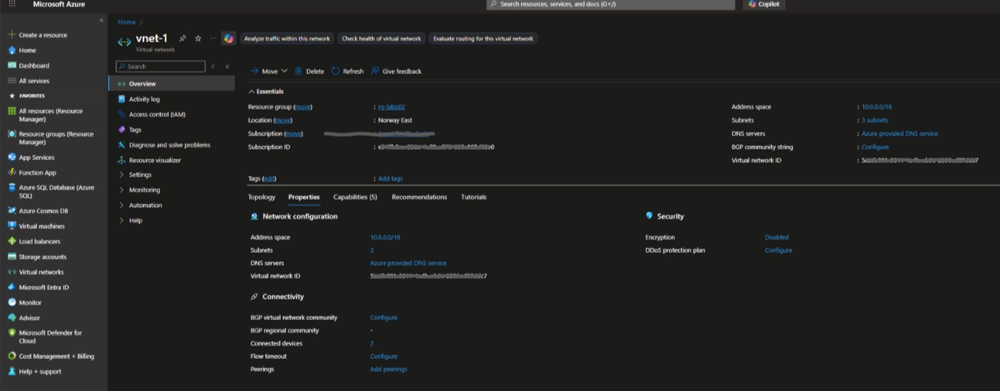

Vue d'ensemble de la VM WebServer, avec son IP privée 10.0.0.4 et son IP publique

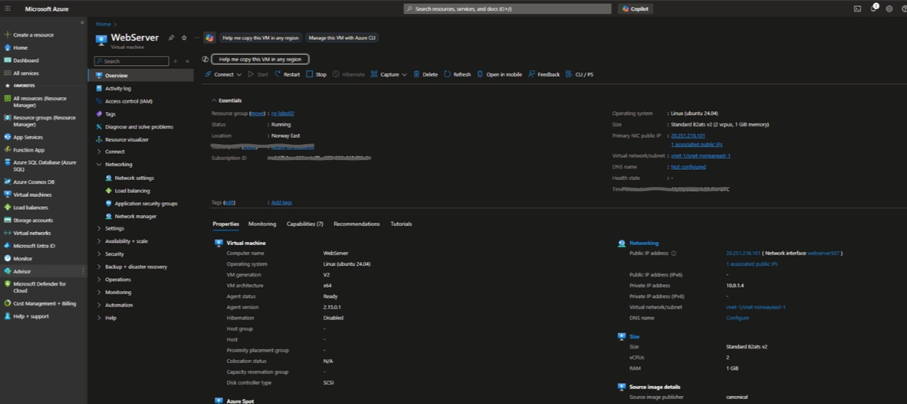

Vue d'ensemble de la VM DataServer, avec son IP privée 10.0.0.5

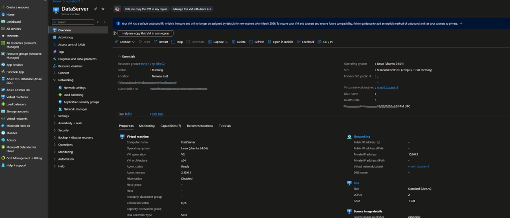

Test de connexion réussi entre les deux machines du VNet

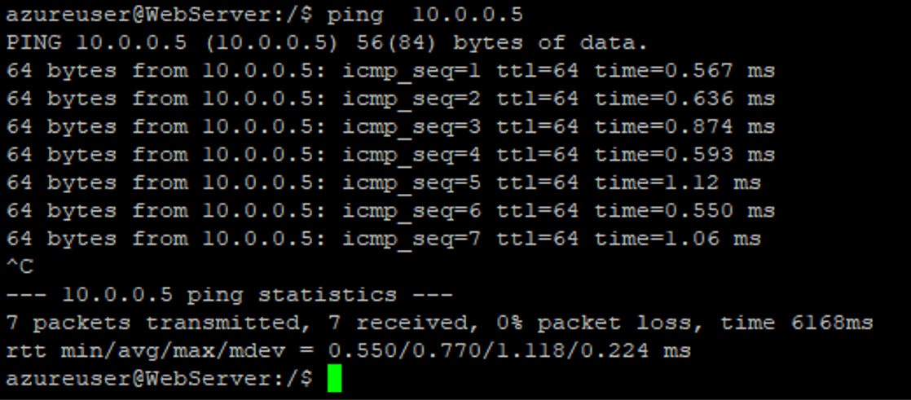

## Étape 2 : le serveur web

Connexion SSH au `WebServer`, installation d'Apache et de PHP, puis rattachement du nom de domaine à l'IP publique via la zone DNS.

```bash
sudo apt install apache2
sudo apt install libapache2-mod-php8.3
```

Un VirtualHost configuré dans `/etc/apache2/sites-available/ordigi.xyz.conf` indique à Apache quel dossier charger quand quelqu'un tape le nom de domaine dans son navigateur. Rien de sorcier, mais c'est la base de tout hébergement web un minimum sérieux.

Installation d'Apache, première partie de la commande

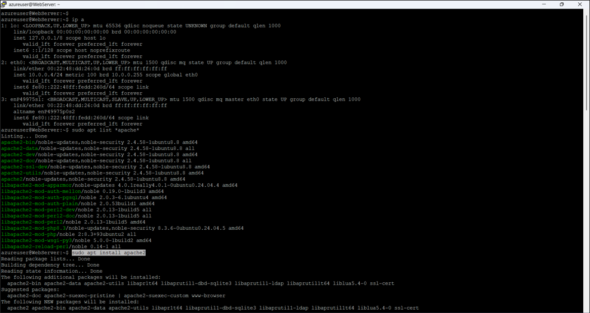

Installation d'Apache, suite de la commande

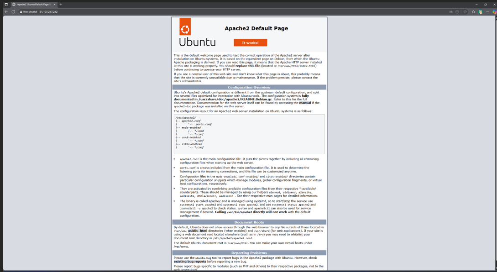

Interface de gestion DNS montrant le pointage (enregistrement A) vers l'IP publique

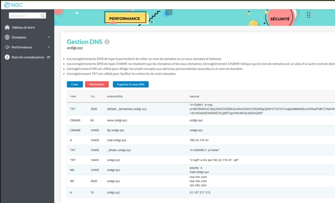

Fichier de configuration du VirtualHost `/etc/apache2/sites-available/ordigi.xyz.conf`

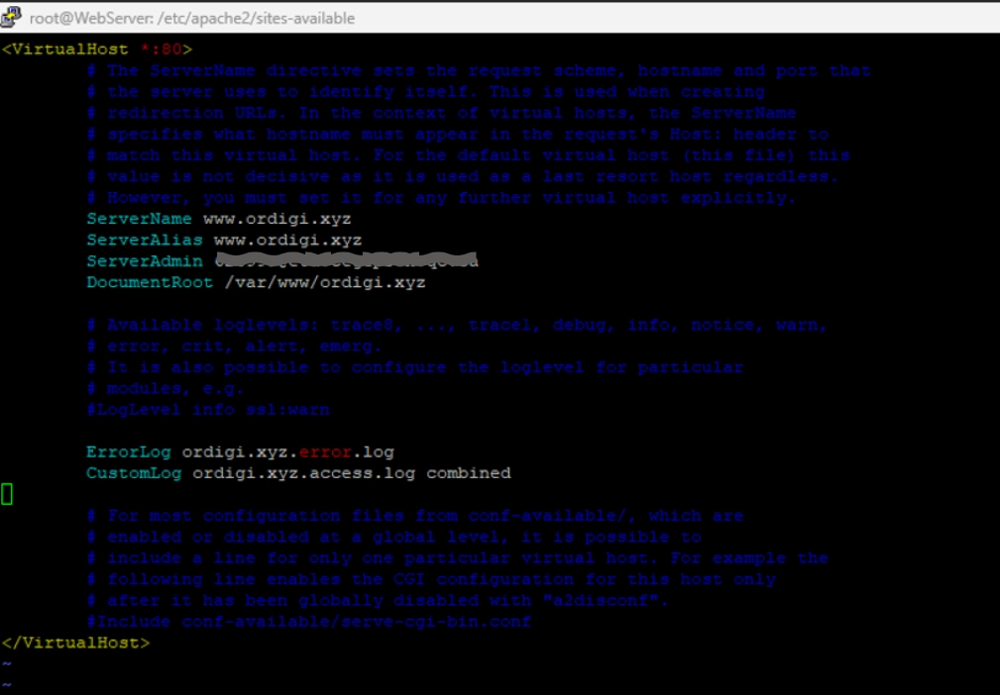

Activation du site avec la commande dédiée

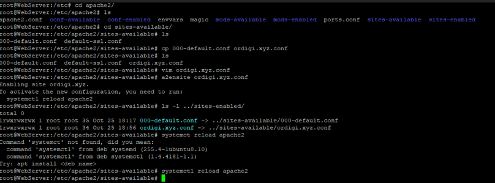

Installation de PHP (`libapache2-mod-php8.3`)

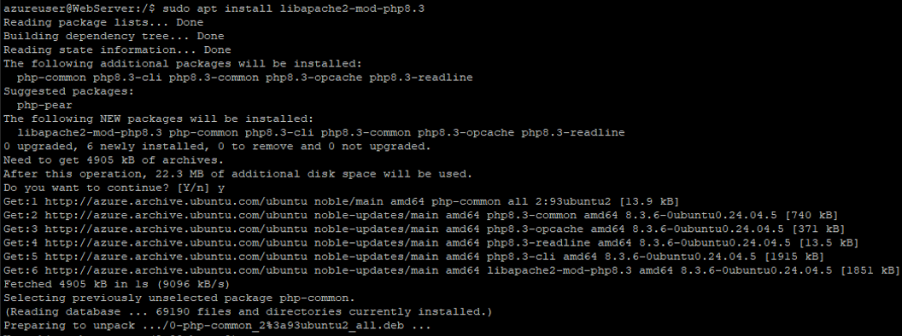

Page "PHP Info" affichée dans le navigateur, encore en HTTP à ce stade

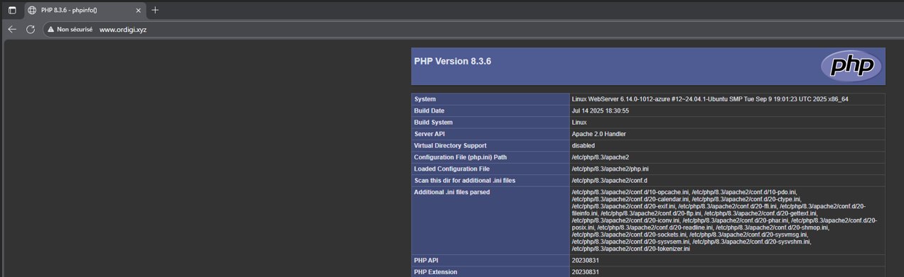

## Étape 3 : HTTPS et pare-feux

Certbot génère un certificat SSL pour forcer le HTTPS. Ensuite viennent les deux couches de pare-feu, NSG côté Azure et UFW côté Ubuntu, qui n'autorisent que les ports 22 (SSH) et 443 (HTTPS).

Deux pare-feux plutôt qu'un, ce n'est pas de la parano gratuite. C'est le principe de la défense en profondeur : le NSG bloque le trafic indésirable avant même qu'il touche la VM, et UFW sert de filet de sécurité si jamais une règle Azure a été mal configurée quelque part.

```bash
sudo ufw status
# 22/tcp   ALLOW
# 443/tcp  ALLOW
```

Terminal confirmant le succès de Certbot

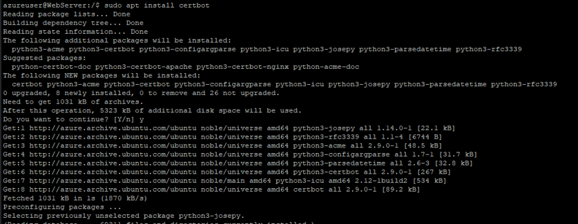

Exécution de la commande Certbot

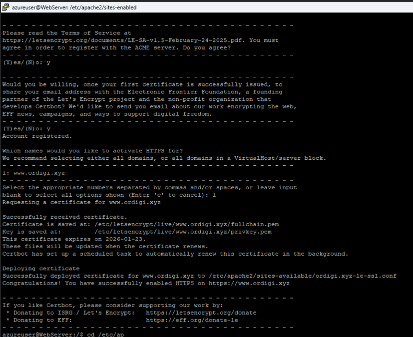

NSG Azure (`WebServer-nsg`) montrant le port 443 autorisé et le 80 bloqué ou redirigé

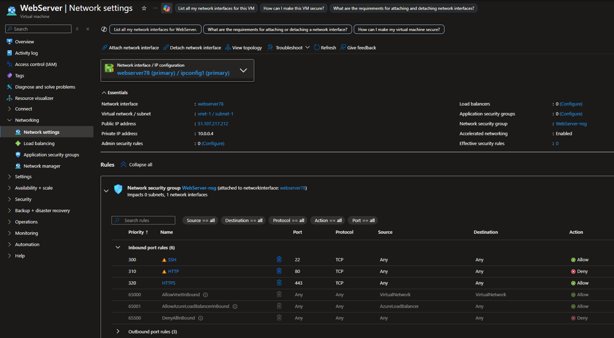

Terminal avec `sudo ufw status`, ports 22 et 443 en ALLOW

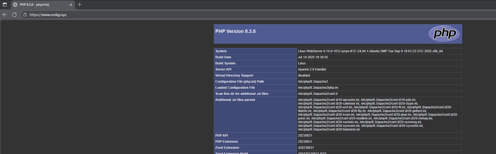

Le site accessible désormais en HTTPS

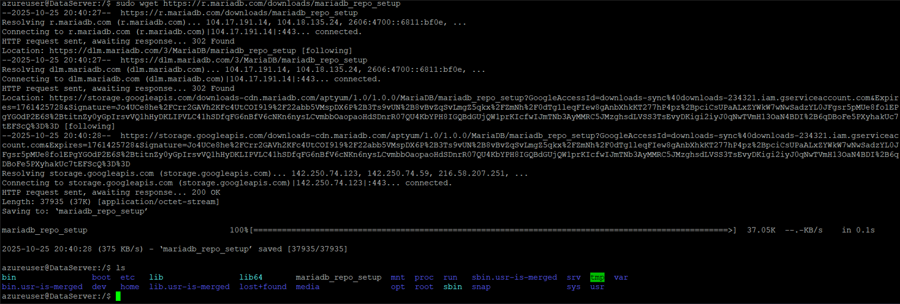

## Étape 4 : le serveur de base de données

MariaDB s'installe sur le `DataServer`, une machine à part entière, physiquement et logiquement distincte du serveur web.

```bash
ssh azureuser@10.0.0.5
sudo apt install mariadb-server
sudo systemctl status mariadb
```

Même si le site web venait à être compromis, les données brutes resteraient hors d'atteinte, sur un serveur que l'attaquant ne voit même pas depuis Internet.

Connexion SSH au serveur de données et début du téléchargement de MariaDB

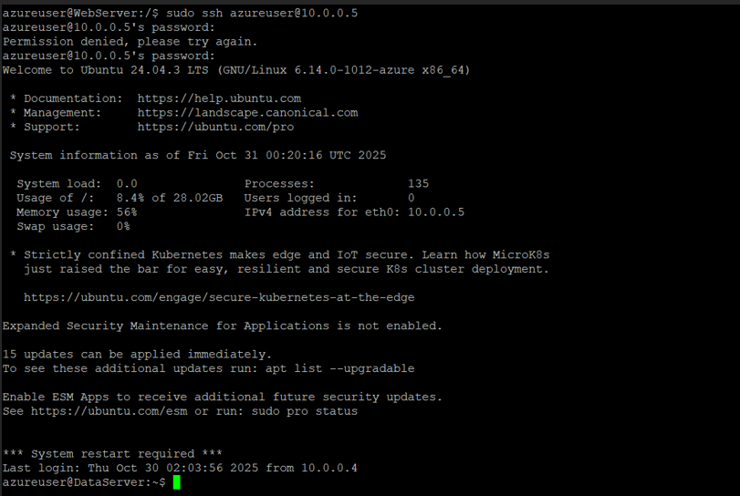

Suite de l'installation de MariaDB


Fenêtre apparue pendant l'installation, répondre "NO" à cette étape

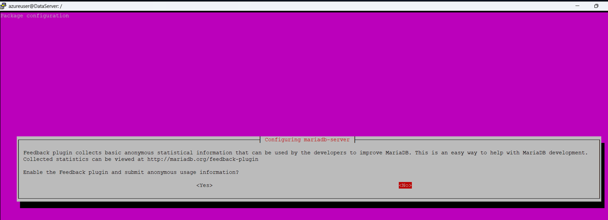

Statut `active (running)` du service MariaDB confirmé

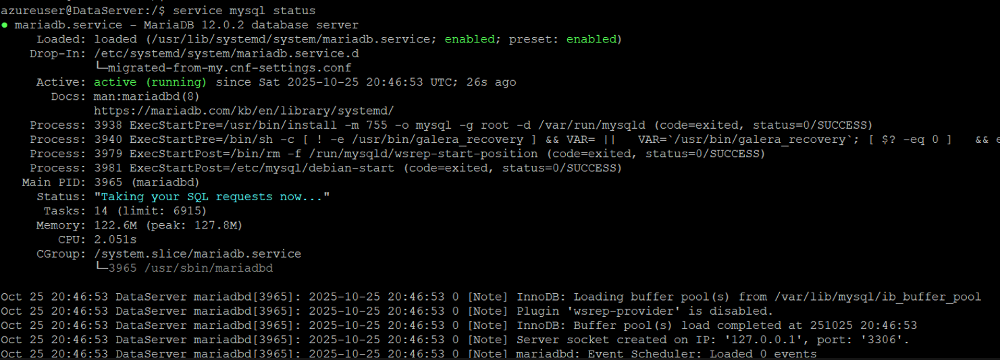

## Étape 5 : verrouiller les communications

C'est l'étape qui fait tout tenir. Sur le `DataServer`, le NSG et UFW sont configurés pour que les ports 22 et 3306 n'acceptent de connexion que depuis `10.0.0.4`, l'IP du `WebServer`. Rien d'autre.

```bash
sudo ufw allow from 10.0.0.4 to any port 3306
sudo ufw allow from 10.0.0.4 to any port 22
sudo ufw enable
```

Une base de données n'a strictement aucune raison d'écouter l'ensemble d'Internet. Cette règle crée un tunnel de confiance exclusif entre les deux machines, et rejette tout le reste, sans exception.

```bash
mysql -h 10.0.0.5 -u webuser -p
```

NSG Azure (`DataServer-nsg`) montrant la source `10.0.0.4` autorisée pour MariaDB

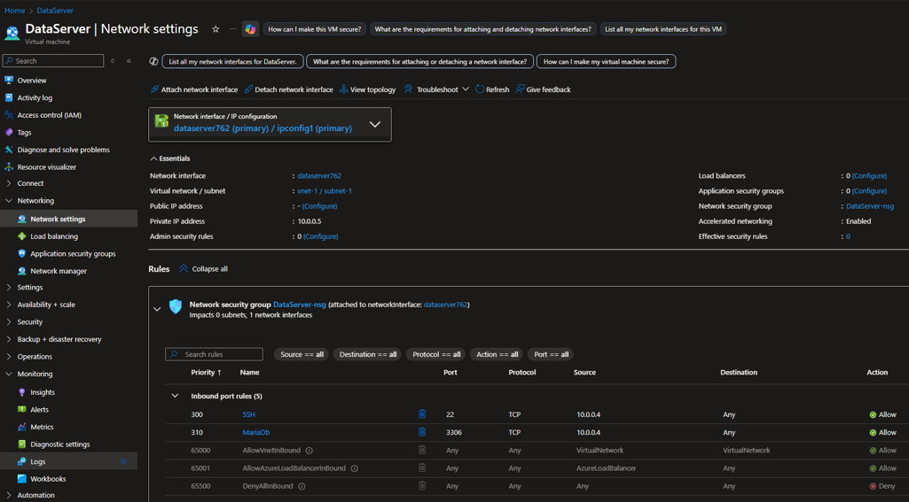

`ufw status verbose` avec `ALLOW IN` limité à `10.0.0.4`

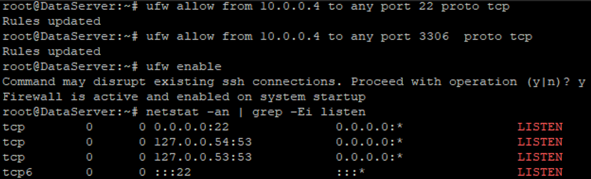

Suite du statut UFW détaillé sur le DataServer

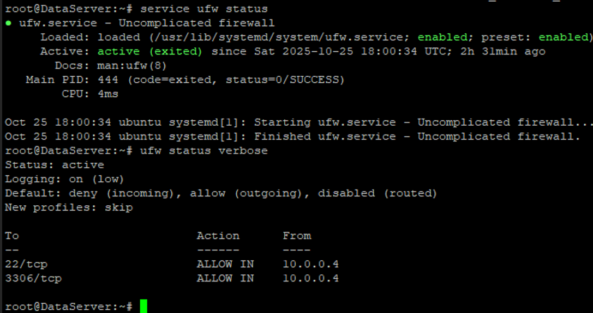

Connexion MySQL réussie depuis le serveur web vers le serveur de données

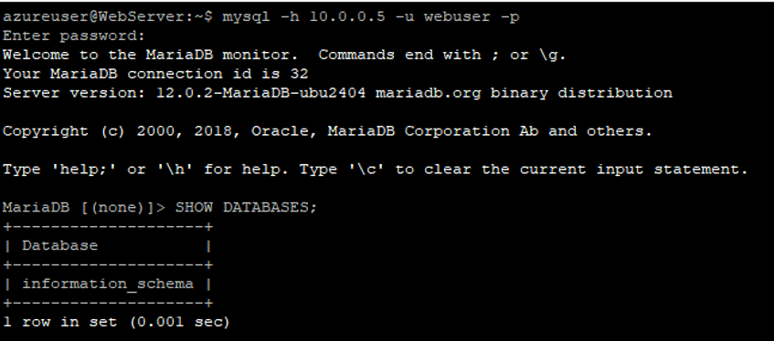

Résultat final après création de la base, de la table et des entrées SQL

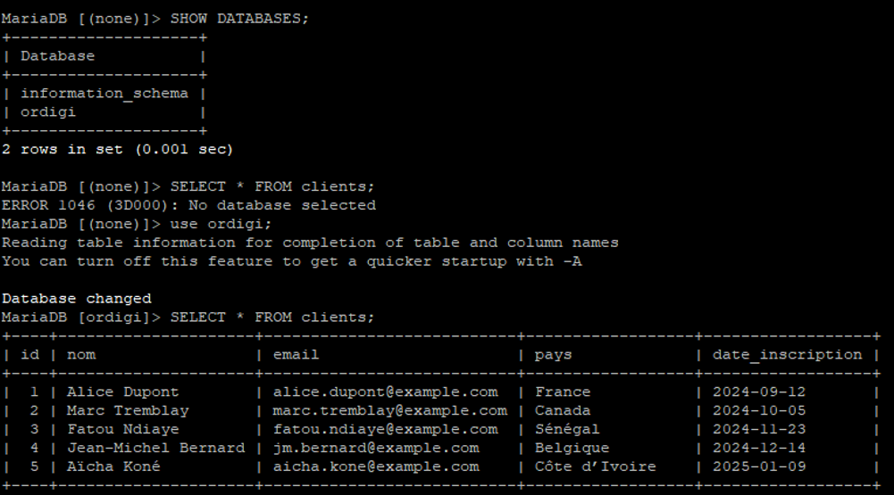

## Étape 6 : la preuve par l'exemple

Une page PHP déployée sur le `WebServer` exécute une requête `SELECT * FROM` vers la base distante et affiche une liste de clients enregistrés. Le navigateur demande la page en HTTPS, le `WebServer` interroge le `DataServer` via son IP privée, le pare-feu du serveur de données reconnaît l'IP autorisée et laisse passer, les données remontent et s'affichent. Toute la chaîne fonctionne.

Site `https://www.ordigi.xyz` affichant la liste des clients enregistrés

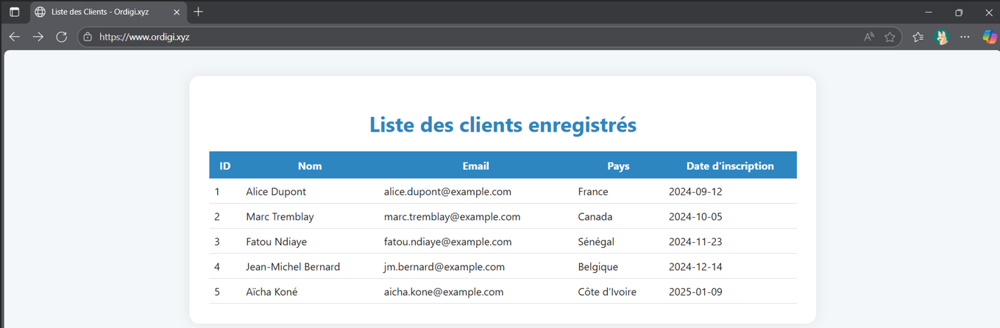

## Pour aller plus loin

Ajouter un load balancer devant plusieurs serveurs web serait une suite logique, tout comme automatiser cette infrastructure avec de l'Infrastructure as Code, Terraform ou Ansible par exemple, plutôt que de tout monter à la main comme ici.

## Alternative locale, sans Azure

Pas de compte cloud ou pas envie de payer un nom de domaine ? Le labo se reproduit très bien en local, façon HomeLab.

VirtualBox ou VMware Workstation Player permettent de monter deux VMs Ubuntu reliées en réseau interne, l'équivalent du VNet Azure, avec des IP du type `192.168.50.4` et `192.168.50.5`. Le nom de domaine se simule en éditant le fichier `hosts` local (`C:\Windows\System32\drivers\etc\hosts` sous Windows, `/etc/hosts` sous Linux et Mac) pour y ajouter une ligne du genre `192.168.50.4 monprojet.local`.

Reste le certificat SSL : Certbot exige un vrai domaine public, donc en local il faut passer par un certificat auto-signé généré avec `openssl`. Le navigateur affichera un avertissement de sécurité, mais la connexion sera bel et bien chiffrée en HTTPS.

---

Projet réalisé dans le cadre de ma formation en informatique.
